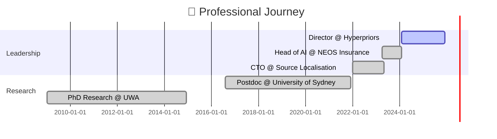

 

 
 
 
 
 

 

 

 <table>
 <tr>
 <td align="center" width="50%">
 
 </td>
 <td align="center" width="50%">
 
 </td>
 </tr>
 </table>

<h1 align="center">
 
</h1>

 

<pre><code class="javascript">const garethRoberts = {
    title: &quot;Senior AI Researcher&quot;,
    location: &quot;Sydney, Australia 🌏&quot;,
    background: {
        neuroscience: &quot;PhD Cognitive Neuroscience &amp; AI&quot;,
        psychology: &quot;BA Honours (Double Major)&quot;,
        business: &quot;MBA - Lean Innovation&quot;
    },
    currentMission: [
        &quot;🧠 Architecting AI with cognitive science principles&quot;,
        &quot;🤝 Building human-centered AI experiences&quot;,
        &quot;⚡ Transforming enterprises with ethical AI&quot;,
        &quot;🔬 Bridging research and real-world applications&quot;
    ],
    achievements: {
        experience: &quot;15+ years&quot;,
        publications: 14,
        speedImprovement: &quot;4.4x&quot;,
        certifications: &quot;20+&quot;
    },
    philosophy: &quot;Bridging how brains think &amp; machines learn 🌉&quot;
};</code></pre>

 

<h1 align="center">
 
</h1>

  

 
 
 

 

<h1 align="center">
 
</h1>

<b>🎯 Click for Full Career Timeline</b>

  

 

  

<h3 id="%F0%9F%8F%A5neosinsurancegroupheadofai">🏥 <strong>NEOS Insurance Group</strong> | Head of AI</h3>

<blockquote>

🎯 <strong>4.4x faster processing</strong> | 🧠 <strong>Psychologically-informed AI</strong> | 🛡️ <strong>APRA Compliant</strong>

</blockquote>

<h3 id="%F0%9F%8C%8Dsourcelocalisationchieftechnologyofficer">🌍 <strong>Source Localisation</strong> | Chief Technology Officer</h3>

<blockquote>

🛰️ <strong>Geospatial AI</strong> | 🤝 <strong>Human-AI Collaboration</strong> | 👥 <strong>Cross-functional Leadership</strong>

</blockquote>

<h3 id="%F0%9F%8E%93universityofsydneypostdoctoralfellow">🎓 <strong>University of Sydney</strong> | Postdoctoral Fellow</h3>

<blockquote>

📚 <strong>14 Publications</strong> | 🧬 <strong>Cognitive Architectures</strong> | 👨‍🏫 <strong>PhD Supervision</strong>

</blockquote>

<h1 align="center">
 
</h1>

  

<h1 align="center">
 
</h1>

 

 <table>
 <tr>
 <td align="center">
 
  <b>AI Underwriting</b>
 </td>
 <td align="center">
 
  <b>Peer Reviewed</b>
 </td>
 <td align="center">
 
  <b>AI &amp; Neuroscience</b>
 </td>
 <td align="center">
 
  <b>ML &amp; Data Science</b>
 </td>
 </tr>
 </table>

<h1 align="center">
 
</h1>

<pre><code class="mermaid">%%{init: {&apos;theme&apos;:&apos;dark&apos;}}%%
graph LR
    A[2005-2009&lt;br/&gt;BA Psychology] --&gt;|Honours| B[2009-2014&lt;br/&gt;PhD Neuroscience &amp; AI]
    B --&gt;|Research| C[2016-2021&lt;br/&gt;Postdoc Sydney]
    B --&gt;|Business| D[2019-2020&lt;br/&gt;MBA]
    C --&gt; E[2022-Present&lt;br/&gt;AI Leadership]
    D --&gt; E
    
    style A fill:#FF6B6B,stroke:#fff,stroke-width:2px,color:#000
    style B fill:#4ECDC4,stroke:#fff,stroke-width:2px,color:#000
    style C fill:#FFE66D,stroke:#fff,stroke-width:2px,color:#000
    style D fill:#A8E6CF,stroke:#fff,stroke-width:2px,color:#000
    style E fill:#00D4FF,stroke:#fff,stroke-width:2px,color:#000</code></pre>

<h1 align="center">
 
</h1>

 
<b>🔥 Latest AI &amp; Neuroscience Insights (Click to Expand)</b>

 

 <table>
 <tr>
 <td align="center">
 
  <b>DAN Attack Analysis</b>
 </td>
 <td align="center">
 
  <b>AI Misbehaviour</b>
 </td>
 <td align="center">
 
  <b>Hidden Behaviours</b>
 </td>
 <td align="center">
 
  <b>Security Psychology</b>
 </td>
 </tr>
 </table>

 

<h1 align="center">
 
</h1>

 
 
 

 <h2>
 
 </h2>

 

