<div align="center">
  
</div>

<div align="center">
  
  [](https://git.io/typing-svg)
  
</div>

<div align="center">
  <a href="https://linkedin.com/in/dr-gareth-roberts">
    
  </a>
  <a href="mailto:gareth.roberts@ieee.org">
    
  </a>
  <a href="https://scholar.google.com/citations?user=DDcANiMAAAAJ">
    
  </a>
  <a href="https://2.works">
    
  </a>
  <a href="https://gareth.portfoliobox.net">
    
  </a>
</div>

<br>

<div align="center">
  
</div>

---


<div align="center">
  <table>
    <tr>
      <td align="center" width="50%">
        
      </td>
      <td align="center" width="50%">
        
      </td>
    </tr>
  </table>
</div>


<h1 align="center">
  
</h1>

<div align="center">
  
</div>

```javascript
const garethRoberts = {
    title: "Principal AI Experience Architect",
    location: "Sydney, Australia 🌏",
    background: {
        neuroscience: "PhD Cognitive Neuroscience & AI",
        psychology: "BA Honours (Double Major)",
        business: "MBA - Lean Innovation"
    },
    currentMission: [
        "🧠 Architecting AI with cognitive science principles",
        "🤝 Building human-centered AI experiences",
        "⚡ Transforming enterprises with ethical AI",
        "🔬 Bridging research and real-world applications"
    ],
    achievements: {
        experience: "15+ years",
        publications: 14,
        speedImprovement: "4.4x",
        certifications: "20+"
    },
    philosophy: "Bridging how brains think & machines learn 🌉"
};
```

<br clear="right"/>


<h1 align="center">
  
</h1>

<div align="center">
  
  
  
  <br><br>
  
  
  
  
  
  
</div>

<div align="center">
  
</div>


<h1 align="center">
  
</h1>

<div align="center">
  
  [](https://hyperpriors.com)
  
  
  
</div>

<details>
<summary><b>🎯 Click for Full Career Timeline</b></summary>

<br>



```mermaid
gantt
    title 🧠 Professional Journey
    dateFormat  YYYY-MM
    section Leadership
    Director @ Hyperpriors           :active, 2024-02, 2025-12
    Head of AI @ NEOS Insurance      :done, 2023-04, 2024-02
    CTO @ Source Localisation        :done, 2022-01, 2023-05
    section Research
    Postdoc @ University of Sydney   :done, 2016-08, 2021-12
    PhD Research @ UWA               :done, 2009-01, 2014-12
```

### 🏥 **NEOS Insurance Group** | Head of AI
> 🎯 **4.4x faster processing** | 🧠 **Psychologically-informed AI** | 🛡️ **APRA Compliant**

### 🌍 **Source Localisation** | Chief Technology Officer  
> 🛰️ **Geospatial AI** | 🤝 **Human-AI Collaboration** | 👥 **Cross-functional Leadership**

### 🎓 **University of Sydney** | Postdoctoral Fellow
> 📚 **14 Publications** | 🧬 **Cognitive Architectures** | 👨‍🏫 **PhD Supervision**

</details>


<h1 align="center">
  
</h1>

<div align="center">
  
  <a href="https://www.neuroprompting.xyz">
    
  </a>
  
  <br><br>
  
  
  
</div>


<h1 align="center">
  
</h1>

<div align="center">
  
  
  
  <br>
  
  <table>
    <tr>
      <td align="center">
        
        <br><b>AI Underwriting</b>
      </td>
      <td align="center">
        
        <br><b>Peer Reviewed</b>
      </td>
      <td align="center">
        
        <br><b>AI & Neuroscience</b>
      </td>
      <td align="center">
        
        <br><b>ML & Data Science</b>
      </td>
    </tr>
  </table>
  
</div>


<h1 align="center">
  
</h1>

<div align="center">
  
  ```mermaid
  %%{init: {'theme':'dark'}}%%
  graph LR
      A[2005-2009<br/>BA Psychology] -->|Honours| B[2009-2014<br/>PhD Neuroscience & AI]
      B -->|Research| C[2016-2021<br/>Postdoc Sydney]
      B -->|Business| D[2019-2020<br/>MBA]
      C --> E[2022-Present<br/>AI Leadership]
      D --> E
      
      style A fill:#FF6B6B,stroke:#fff,stroke-width:2px,color:#000
      style B fill:#4ECDC4,stroke:#fff,stroke-width:2px,color:#000
      style C fill:#FFE66D,stroke:#fff,stroke-width:2px,color:#000
      style D fill:#A8E6CF,stroke:#fff,stroke-width:2px,color:#000
      style E fill:#00D4FF,stroke:#fff,stroke-width:2px,color:#000
  ```
  
</div>


<h1 align="center">
  
</h1>

<div align="center">
  
  <details>
  <summary><b>🔥 Latest AI & Neuroscience Insights (Click to Expand)</b></summary>
  
  <br>
  
  <table>
    <tr>
      <td align="center">
        
        <br><b>DAN Attack Analysis</b>
      </td>
      <td align="center">
        
        <br><b>AI Misbehaviour</b>
      </td>
      <td align="center">
        
        <br><b>Hidden Behaviours</b>
      </td>
      <td align="center">
        
        <br><b>Security Psychology</b>
      </td>
    </tr>
  </table>
  
  <br>
  
  
  
  </details>
  
</div>


<h1 align="center">
  
</h1>

<div align="center">
  
  
  
  
  
  
</div>


<div align="center">
  
  
  
  <h2>
    
  </h2>
  
  <br>
  
  
  
</div>


